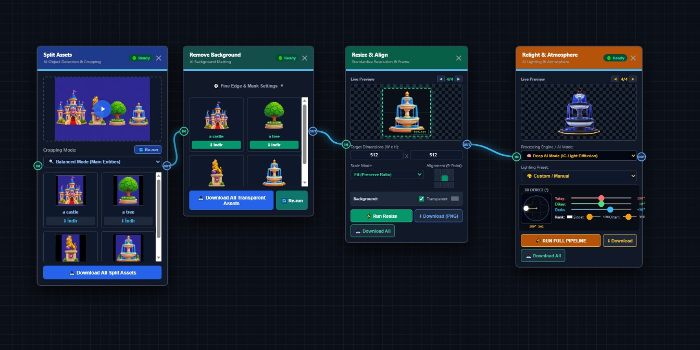

<div align="center">

# 🌟 Agent Studio
### Open-Source, Node-Based Visual AI Pipeline for Batch Production

[](https://www.python.org/downloads/)
[](https://fastapi.tiangolo.com)
[](https://pytorch.org/)
[](https://opensource.org/licenses/MIT)

<br/>



<p align="center">
  <b>Agent Studio</b> is a lightweight, local, and fully portable visual AI node-graph pipeline designed for game developers, VFX artists, and AI creators. 
  Perform batch background removal, 360° spherical 3D relighting, vision-language auto captioning, and multi-format exports in one unified canvas.
</p>

</div>

---

## ✨ Key Features

| Node | Powered By | Description |
| :--- | :---: | :--- |
| **📂 Batch Loader** | Native Virtual FS | Load hundreds of images, sprite sheets, or folder directories with instant thumbnail navigation. |
| **✂️ Split Assets** | Microsoft **Florence-2** | AI-driven bounding-box object segmentation & auto-captioning (Detailed, Whole, Balanced). |
| **🪄 Remove BG** | **BiRefNet** / RMBG | High-precision human/object matting and transparent alpha mask generation. |
| **💡 Relight & Atmosphere** | **IC-Light** (SD 1.5) + Shader | 360° spherical 3D light rotation (Yaw/Pitch/Depth in degrees °), RGB color tinting, and specular/rim backlighting. |
| **🎬 Timeline Sequencer** | Linear & Spline S-Curve Engine | Unreal Engine style keyframe tracks, 64-frame sequence generation (`people_0000.png`...`people_0063.png`), and live scrubber playbar. |
| **📐 Resize & Align** | Smart Canvas Matrix | Custom padding, auto centering, aspect-ratio preservation, and live preview forwarding. |
| **💾 Multi-Format Exporter** | Multi-Res Engine | Batch disk export to PNG, JPEG, WebP, AVIF across 1x, 2x, 4x resolutions. |

---

## 🚀 Quick Start (Windows 1-Click Portable)

No Python or CUDA pre-installation required!

1. **Clone or Download** this repository:
   ```bash
   git clone https://github.com/YOUR_USERNAME/NodeAgent_Studio.git
   cd NodeAgent_Studio
   ```
2. Double-click **`run.bat`**.
3. The launcher will automatically:
   - Setup an isolated portable Python 3.10 environment (without modifying your OS).
   - Install PyTorch (CUDA GPU accelerated) and dependencies.
   - Launch the desktop application window at `http://127.0.0.1:8000`.

---

## 🧠 AI Model Hub & 1-Click Installation

All models are downloaded directly into the isolated `models_cache/` directory inside the project folder:
* **BiRefNet**: Ultra-sharp background segmentation.
* **Florence-2 Large**: Vision-language object detection and detailed prompt captioning.
* **IC-Light (SD 1.5 + VAE)**: Photorealistic diffusion-based directional relighting with 8-channel UNet conditioning.

You can download or repair models anytime using the **1-Click Model Manager** directly in the UI!

---

## 🌐 3D Spherical Degree Lighting & Keyframe API

The **Relight & Atmosphere** node supports full 3D spherical rotation in degrees:
* **🔄 Yaw (Yatay):** `0° ... 360°` (Horizontal rotation around object)
* **📐 Pitch (Dikey):** `-90° ... +90°` (Zenith to Nadir elevation)
* **🌐 Depth (Ön/Arka):** `-90° ... +90°` (Backlight rim to flat front illumination)

```javascript
// Programmatic Keyframe State API for future animation sequences:
const lightState = node.getLight3DState();
// Returns: { yaw: 180, pitch: 0, depth: 30, color: "#ffffff", intensity: 1.0, engine: "ai" }
```

---

## 📜 License

Distributed under the **MIT License**.

